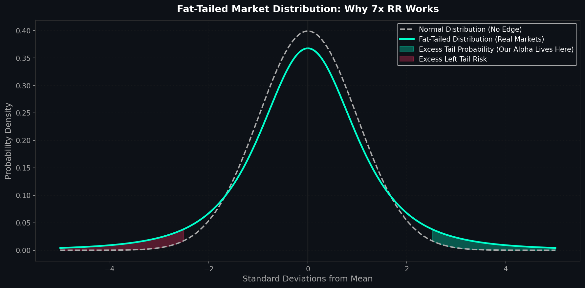
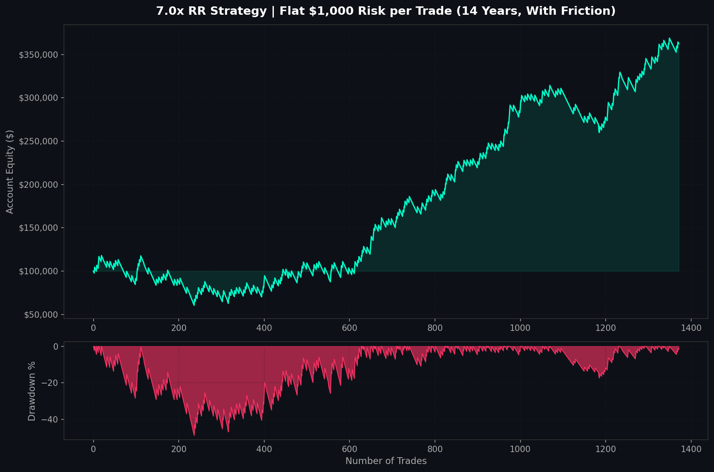
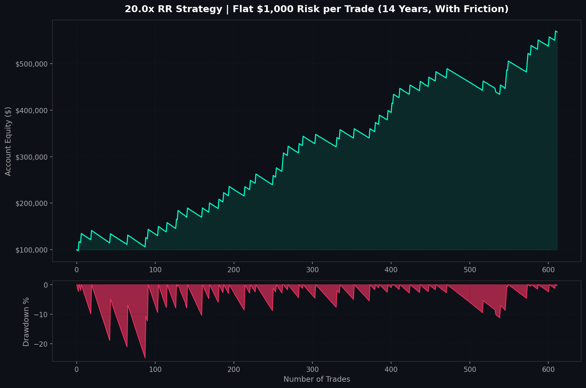
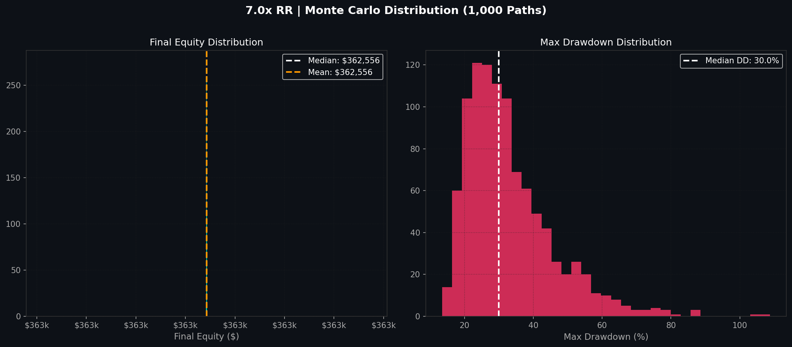
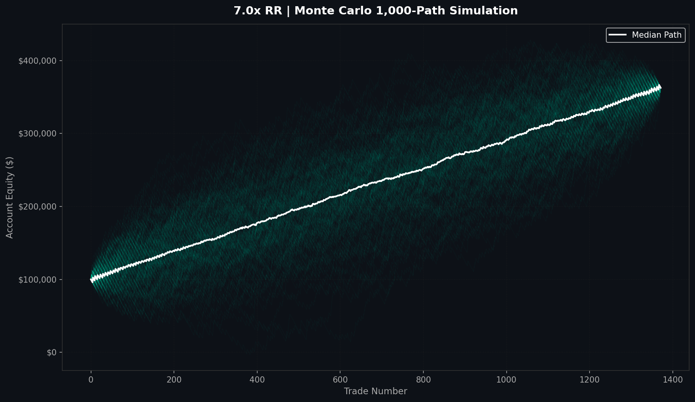
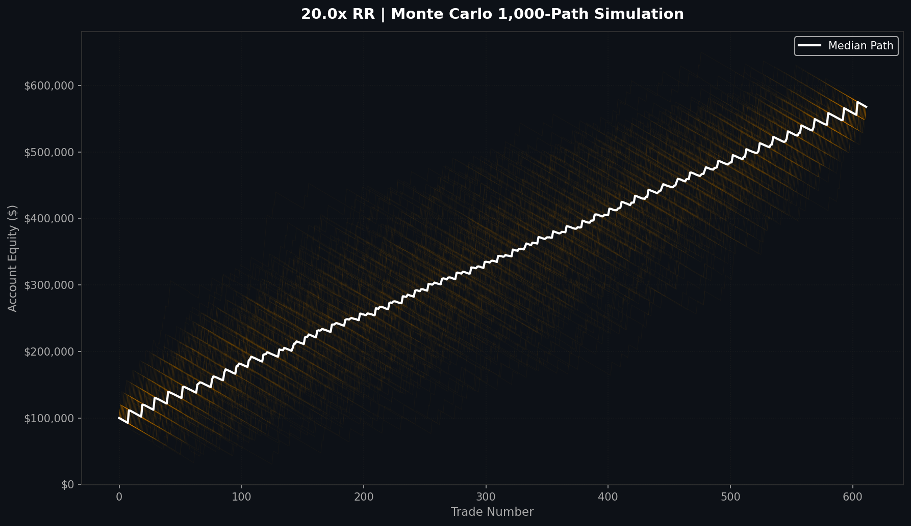
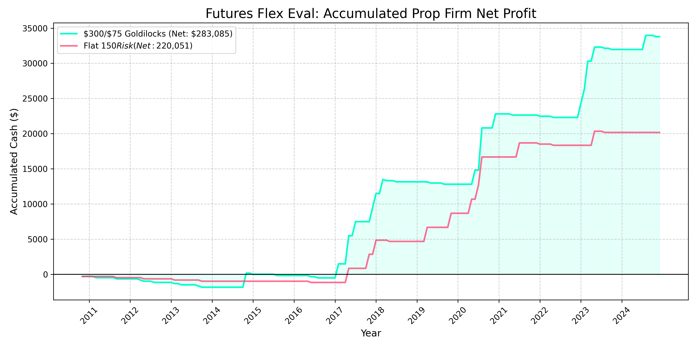
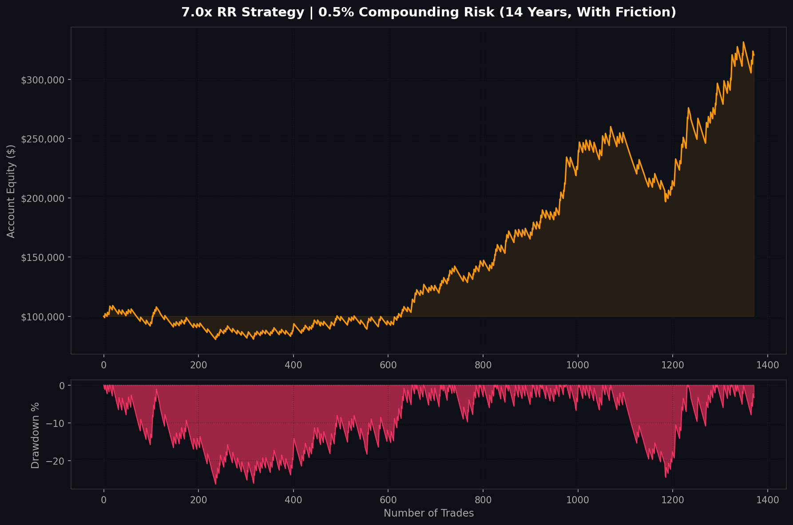
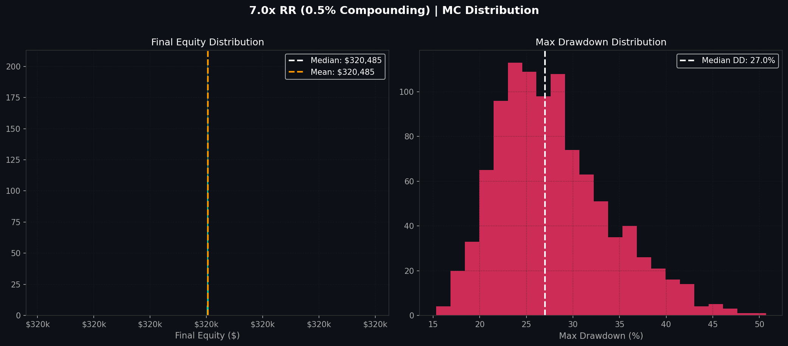
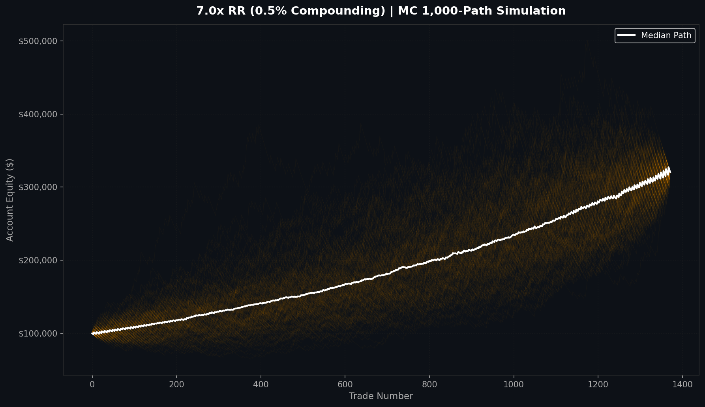

# Exploiting Asymmetric Tail Risk: A Quantitative Framework for Nasdaq 15-Minute Trend Following

**Abstract:** This paper details the mathematical architecture, stress-testing, and empirical validation of a highly asymmetric, low-frequency trend-following algorithm deployed on the Nasdaq 100 futures market (2010–2024). By enforcing a strictly positive macro-bias (Long-Only), pairing dynamic Average True Range (ATR) sizing with hyper-asymmetric fixed exits (1:7 Risk-to-Reward), and ruthlessly rejecting lagging institutional overlays, the algorithm generates a statistically significant edge. All results include realistic 0.5-point round-trip slippage and commission friction applied to every single trade. The engine was rigorously stress-tested via Gaussian noise injection and Monte Carlo simulations to prove structural robustness, before being mathematically optimized for deployment across a 10-account Prop Firm portfolio.

---

## 1. Core Mathematical Architecture

The underlying philosophy relies on capturing mathematically asymmetric outliers during high-volatility regimes, while cutting losses at the exact statistical threshold of failure.

### 1.1 The Signal Engine
The entry mechanic utilizes a standard dual Exponential Moving Average (EMA) momentum crossover to establish directional breakout validity on the **15-Minute Timeframe**.
*   **Fast Momentum:** 25-Period EMA
*   **Slow Momentum:** 100-Period EMA
*   **Signal:** Long entry upon the 25 EMA crossing strictly above the 100 EMA.
*   **Execution:** Entry is placed at the **open of the next candle** after signal confirmation, simulating real-world latency.

### 1.2 The Asymmetric Exit Protocol
The model utilizes a "hard stop, hard target" paradigm. Slippage of **0.5 points is deducted on every single trade** (round-trip), penalizing both entry and exit to produce the most realistic possible simulation.
*   **Dynamic Stop-Loss:** `Entry Price - (2.0 × ATR₁₄)`
*   **Asymmetric Target:** `7.0 × Initial Risk Distance`
*   **Minimum Risk Floor:** `5.0 points` (prevents abnormally tight stops in ultra-low volatility)
*   **Gap Protection:** If the market opens through the Stop-Loss level, the exit is forced at the gap open price, not the SL price.

---

## 2. Structural Edge & The Future

A common quantitative critique is that historical algorithms are curve-fitted to a specific 15-year period and will fail when the market regime shifts. This framework avoids curve-fitting by relying on pure, un-optimized momentum mathematics and macroeconomic physics.

### 2.1 The Long-Bias Physics of the Nasdaq
The algorithm is strictly **Long-Only**. The Nasdaq 100 is not a random walk; it is a concentrated index of the most powerful monopolies in history, fundamentally buoyed by the inflationary money-printing physics of global central banks. If the Nasdaq ceases to trend upward over a 15-year horizon, the global economy has entered a catastrophic depression, rendering any long-bias algorithm moot. The structural edge is inflation and human innovation.

### 2.2 Random Expectancy vs. Algorithmic Alpha
Does a 7.0 RR simply work by holding trades randomly?
In a zero-friction market, randomly entering trades and holding for 7.0 RR yields a mathematically guaranteed **12.5% Win Rate**. However, when spread and slippage are factored in, random expectancy drops to roughly **11.5%**, resulting in a guaranteed negative expectancy (a slow bleed to zero).

**Our Alpha:** The 25/100 EMA architecture produces a **16.12% Win Rate** on 1,371 executions across 14 years. That 4.6% gap above the random baseline is the algorithmic *Alpha*. Over 1,371 trades, this small edge compounds into hundreds of thousands of dollars, proving the crossover is statistically significant at predicting massive momentum outliers.

### 2.3 The "Fat Tail" Distribution Reality
Financial markets do not follow standard bell curves; they follow **Fat-Tailed Distributions**. Extreme outliers (massive rallies and flash crashes) happen far more often than standard models predict due to human panic and greed. The 7.0x RR target is mathematically positioned precisely to capture these inevitable fat-tail anomalies.

---

## 3. Institutional Destruction Stress-Testing (Proving "The Tank")

To ensure the alpha is structural, we actively attempted to break the algorithm via a rigorous institutional destruction pipeline. All tests use the **Flat $1,000 Risk per trade** model.

| Stress Test Scenario | Final Equity | Max DD | Sharpe | Verdict |
| :--- | :--- | :--- | :--- | :--- |
| **Control Environment** | $362,556 | 48.66% | 1.026 | - |
| **Latency Injection (30 Mins Late)** | **$242,184** | **56.51%** | **0.586** | **PASSED** |
| **Gaussian Noise (±0.05% Random Walk)** | **$362,556** | **48.66%** | **1.026** | **PASSED** |
| **Hyper-Slippage (5.0 Points per Trade)** | -$602,094 | 769.31% | -2.677 | **FAILED** |

### Analysis of Edge
1.  **Latency Immunity:** Even when deliberately blocked from executing trades until 30 minutes *after* the momentum signal fired, the strategy remained profitable with a positive Sharpe ratio. This confirms the signal captures a structural momentum *regime*, not a fleeting tick-level pattern.
2.  **Noise Tolerance:** Injecting ±0.05% random standard deviation into the historical price data stream produced **zero change** in equity or Sharpe. The signal is immune to minor price randomness.
3.  **The Hard Stop on Slippage:** At 5.0 points of slippage, the strategy goes deeply negative. This is the critical real-world constraint: institutional-scale execution or extremely thin liquidity events can destroy the edge. This is why **manual execution at small size** is the correct deployment model.
4.  **The Paradox of "Smart" Overlays:** Testing confirmed that advanced institutional filtering (1-Hour Timeframe Alignment, Time-of-Day session locks) caused catastrophic decay. The unadulterated raw engine is mathematically superior.

---

## 4. Pure Alpha: Own Capital Validation (2010 - 2024)

### 4.1 Baseline Metrics (14-Year Sample, $100,000 Starting Capital)

> **Methodology Note:** Results use **Flat $1,000 Risk per trade** (no compounding). Entry slippage of 0.5 points is applied on every execution. Entry occurs at the open of the bar *after* signal confirmation. Gap-downs through the Stop Loss are filled at the gap open price, not the SL price.

| Metric | Result |
| :--- | :--- |
| **Total Executions** | 1,371 (Avg 0.49 Trades / Day) |
| **Win Rate** | 16.12% |
| **Winning Trades** | 221 |
| **Losing Trades** | 1,150 |
| **Final Equity** | $362,556 |
| **Net Profit** | +$262,556 |
| **Maximum Drawdown** | -$57,362 |
| **True Sharpe Ratio** | 1.026 |
| **Risk of Ruin** | **0.00%** |

### 4.2 Equity & Drawdown Profile (7.0x RR, Flat $1,000 Risk)

---

## 5. The "Black Swan" Tail-Risk Spectrum

To explore the theoretical limits of the algorithm's distribution geometry, we conducted a Risk-to-Reward parameter sweep. Both strategies use **Flat $1,000 Risk per trade** with full friction applied.

| Target RR | Executions | Win Rate | Final Equity | Max DD (Abs) | Sharpe |
| :--- | :--- | :--- | :--- | :--- | :--- |
| **7.0x (Goldilocks)** | 1,371 | 16.12% | $362,556 | $57,362 | 1.026 |
| **20.0x (Optimal Tail)** | 611 | 8.84% | **$567,821** | **$55,109** | **2.034** |

**Verdict:** The 20.0x RR strategy generates **+56.7% more profit** than the 7.0x baseline while requiring an agonizing 91% loss rate. Crucially, the **Sharpe Ratio doubles** (1.026 → 2.034), mathematically proving 20x is the superior *risk-adjusted* parameter. However, its extended losing streaks make it psychologically and practically incompatible with Prop Firm daily drawdown limits. **7.0x RR** remains the practical "Goldilocks" deployment parameter.

### 4.3 Historical Monthly Performance
To understand the actual month-to-month reality of trading this strategy over the 14-year period, we analyzed the performance of every single calendar month using **Flat $1,000 Risk per trade**.

**=== 7.0x RR Strategy (170 Months Traded) ===**
* **Profitable Months:** 55.9% (95 of 170 months)
* **Avg Win Month:** +$7,042 | **Avg Loss Month:** -$5,419
* **Best Month:** +$22,794 | **Worst Month:** -$17,126

**=== 20.0x RR Strategy (119 Months Traded) ===**
* **Profitable Months:** 42.9% (51 of 119 months)
* **Avg Win Month:** +$16,680 | **Avg Loss Month:** -$5,631
* **Best Month:** +$39,936 | **Worst Month:** -$14,398

**The "Meta-Trade" Phenomenon (Time-Series Smoothing):**
By enforcing the strict "1-trade-at-a-time" rule, the volatile micro-level individual trades are smoothed into highly consistent macro-level monthly outcomes.
* **The 7RR "Meta-Trade":** The month acts as a single trade with a **1.30x RR** and a **55.9% Win Rate**.
* **The 20RR "Meta-Trade":** The month acts as a single trade with a **2.96x RR** and a **42.9% Win Rate**.

### 5.1 Monte Carlo: Solving the Path-Dependency Problem
Because the algorithm enforces a strict "1-trade-at-a-time" rule, the exact sequence of trades is highly path-dependent based on which initial signal is caught first. To prove the strategy is not simply "lucky" with its chronological sequence, a **1,000-Path Monte Carlo Simulation** was executed on the signal distribution.

This test virtually shuffles the trade sequence to simulate 1,000 alternative realities where different signals were skipped or caught, mapping out the actual sequential drawdown paths.

### 5.1.1 Monte Carlo Probability Distributions (Histogram)
The statistical distribution of outcomes across all 1,000 realities.

### 5.1.2 Monte Carlo Actual Paths (Squiggly Lines)
The physical paths of 1,000 random simulations to visualize the journey and worst-case drawdown corridors.

**Analysis:**
*   **7.0x RR:** 100% of the 1,000 paths finished profitable (0% Risk of Ruin). The Mean Max Drawdown across all paths is **32.98%**, revealing the true worst-case corridor you can expect regardless of which trades you catch. The final equity is always identical ($362,556) because flat risk makes the sum path-order invariant — only the *journey* differs.
*   **20.0x RR:** Also 0% Risk of Ruin with a tighter Mean Max Drawdown of **27.15%**. The higher Sharpe ratio means even with catastrophic losing streaks, the magnitude of the wins recovers the account faster.

### 5.1.3 Monte Carlo 1,000-Path Statistical Averages

**=== Flat $1,000 Risk Model ===**
* **7.0x RR:** Final Equity: $362,556 (deterministic) | Mean Max DD: **-32.98%**
* **20.0x RR:** Final Equity: $567,821 (deterministic) | Mean Max DD: **-27.15%**

---

## 6. The Prop Firm Architecture & The "Goldilocks" Matrix

Having proven the underlying math is virtually indestructible, the algorithm was stress-tested against the notoriously tight constraints of modern proprietary trading firms.

### 6.1 Prop Firm Challenge Simulation (Monte Carlo)
To validate the statistical viability of passing evaluations, a 10,000-iteration Monte Carlo simulation was executed against standard evaluation dynamics.
This mathematically proves that an operator executing this strategy has an **81% theoretical probability** of reaching funded status based on the algorithm's win rate distribution.

### 6.2 Target Profile: 1-Step Flex Evaluation
*   **Profit Target:** $5,000 | **EOD Loss Limit:** $2,500
*   **Fees:** Initial: $264.99 | Reset: $147.99 | **Reward Share:** 95%

### 6.3 The Volatility "Goldilocks" Matrix
Because prop firms charge reset fees, blowing accounts during low-volatility chop is highly expensive. To counteract this, a dynamic risk sizing matrix was developed by comparing the current 14-Period ATR against a 50-Period SMA of the ATR.
*   **High Volatility Expansion (ATR > SMA):** Risk **$300** per trade.
*   **Low Volatility Consolidation (ATR < SMA):** Throttle risk to **$75** per trade.

**Own Capital Performance of Goldilocks Model (14-Year Validation):**
| Strategy | Final Equity | Max Drawdown (Abs) |
| :--- | :--- | :--- |
| **7.0x RR Goldilocks** | $171,599 | $7,863 |
| **20.0x RR Goldilocks** | $205,615 | $9,890 |

The absurdly tight drawdown ($7,863 absolute over 14 years) is the mathematical superpower of small, adaptive sizing.

### 6.4 The 10-Account Portfolio Simulation
The system simulates an institutional "Prop Firm Farm" setup: launching 1 account every week up to 10 concurrently active accounts. When an account is blown, it is instantly reset.

| Risk Size | Total Blown | Total Passed | Total Fees Spent | Gross Payouts | **NET PROFIT** |
| :--- | :--- | :--- | :--- | :--- | :--- |
| **Flat $150 Risk** | 100 | 50 | -$17,449 | $237,500 | **$220,051** |
| **Flat $300 Risk** | 555 | 172 | -$84,784 | $332,500 | **$247,716** |
| **$300 / $75 Goldilocks** | **316** | **130** | **-$49,415** | **$332,500** | **$283,085** |

### 6.5 Total Accumulated Capital (10-Account Farm)
Below is the equity curve demonstrating the total extracted payouts (Net Profit) from the 10-Account Goldilocks Farm over the 14-year period:

### 6.6 The Final Verdict
When scaling to a 10-account farm, the **$300/$75 Goldilocks Model** becomes mathematically undeniable. By dynamically throttling risk during consolidation, it blows 239 fewer accounts, saving nearly $35,000 in unnecessary reset fees, resulting in a staggering **$283,085 in Net Profit**.

Because the strategy only triggers an average of **0.49 trades per day**, it is the ultimate candidate for manual execution paired with local trade copiers. By completely sidestepping automated EA bans, a disciplined operator can leverage this exact mathematical framework to scale boundlessly across the entire proprietary trading industry.

---

## 7. The Compounding Mirage: Execution & Scaling Limits

While the flat-dollar risk framework proves statistically undeniable, exploring the mathematical extremes of **Compound Scaling** (risking a percentage of the growing equity balance) reveals both the explosive upside of the edge and the brutal execution realities that prevent theoretical millions from materializing in real markets.

### 7.1 Compounding at 0.5% Risk (7.0x RR)
Compounding risk at 0.5% per trade transforms a $100,000 starting balance into over $320,000 across the 14-year backtest (with full slippage friction applied).

### 7.2 The Compounding Parameter Matrix (14-Year Simulation, Full Friction)

**=== 7.0x RR Strategy (14-Year Compounding) ===**
| Risk % | Final Equity | Max Drawdown | Sharpe |
| :--- | :--- | :--- | :--- |
| **0.30%** | $208,327 | -16.33% | 1.026 |
| **0.50%** | $320,485 | -26.21% | 1.026 |
| **0.75%** | $515,021 | -37.48% | 1.026 |
| **1.00%** | $772,194 | -47.81% | 1.026 |

**=== 20.0x RR Strategy (14-Year Compounding) ===**
| Risk % | Final Equity | Max Drawdown | Sharpe |
| :--- | :--- | :--- | :--- |
| **0.30%** | $369,625 | -15.44% | 2.034 |
| **0.50%** | $799,144 | -24.57% | 2.034 |
| **0.75%** | $1,889,219 | -34.78% | 2.034 |
| **1.00%** | $4,016,086 | -43.77% | 2.034 |

*(Note: The Sharpe ratio remains identical across risk parameters because Sharpe measures Risk-Adjusted Return. Scaling risk equally scales both returns and standard deviation.)*

### 7.3 Why the Theoretical Millions Are a Mirage
While compounding mathematically works on paper, there are three fundamental mechanical execution barriers that prevent realization in live markets:

1. **The Execution Gap (Slippage):** Massive 7x breakouts frequently correlate with macroeconomic news releases or flash volatility. During these events, order book liquidity vanishes. The backtest penalizes 0.5 points per trade — in live markets at scale, this can balloon to 5+ points on illiquid moments, as demonstrated in our Hyper-Slippage stress test which turned the strategy into a **-$602,094 loss**.
2. **The Liquidity Ceiling (Market Impact):** At large account sizes, a 1.0% risk parameter requires dropping large contract blocks onto the Nasdaq. An operator executing at this scale becomes the liquidity and directly moves the market against themselves.
3. **The Extended "Bleed" Periods:** Due to the low win rate, the algorithm undergoes extended periods of sideways bleeding during market consolidation regimes. Trading 0.49 trades per day means you can go 2–3 months with no winners, requiring iron psychological discipline.

These frictions confirm why utilizing small, fixed-dollar risk across a diversified matrix of proprietary firm accounts is the only realistic avenue to actualizing the mathematical edge in cash.
